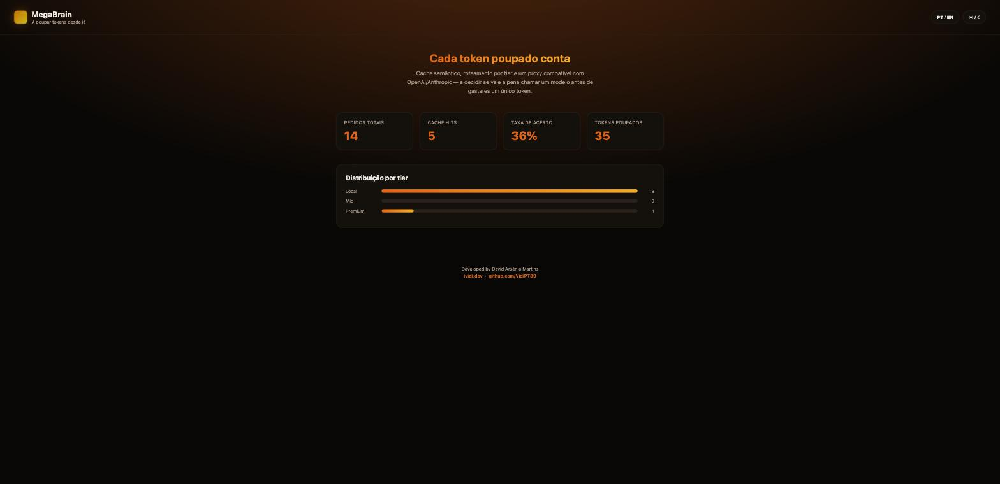

# 🧠 MegaBrain

> Drop-in OpenAI/Anthropic-compatible proxy, CLI and live dashboard that cut LLM token spend, painted in the ividi.dev palette (black, burnt orange, amber).

[🐞 Report Bug](https://github.com/VidiPT89/MegaBrain/issues) · [✨ Request Feature](https://github.com/VidiPT89/MegaBrain/issues)



MegaBrain sits between your app and your LLM provider. Point your OpenAI or Anthropic SDK at it, no code changes, and it decides if a call is even worth making before spending a single token: a semantic cache answers repeated questions instantly, a tier router flags how complex each prompt really is, and a live dashboard shows exactly how much you saved. It works just as well with a fully local, free backend like Ollama.

This repo has two ways to run it:
- **CLI, below** — runs on your own machine, `npx`-style, zero accounts needed.
- **[Hosted web app](web/)** — sign in with GitHub, bring your own API key, and get the same proxy and dashboard as a multi-user site (Next.js on Vercel, Postgres on Neon). See [web/README.md](web/README.md) to run or deploy it.

## ✨ Main Features

- ✅ **Drop-in proxy** — `/v1/chat/completions` (OpenAI) and `/v1/messages` (Anthropic), same request/response shape
- ✅ **Streaming support** — `stream: true` works end-to-end, including instant streamed replies on cache hits
- ✅ **Semantic cache** — real embeddings (Ollama `nomic-embed-text`) when available, with a zero-dependency term-frequency fallback otherwise. Only applied to single-turn requests (one user message, no prior history) — a multi-turn conversation (agents, chat UIs, coding assistants) still gets tier routing, but skips the cache, since matching only on the latest message could return a cached reply from a completely different conversation
- ✅ **Tier router** — heuristic `local` / `mid` / `premium` classification, then auto-picks the cheapest configured provider for that tier (Ollama → Groq/Gemini free tier → paid fallback)
- ✅ **Live dashboard** — animated stats: total requests, cache hit rate, tokens saved, tier distribution, and which actual provider (Ollama/Groq/Gemini/OpenAI/Anthropic) served each request
- ✅ **PT / EN toggle** — remembered in `localStorage`
- ✅ **Dark / light** — dark by default, same burnt orange and amber, cream paper in light mode
- ✅ **Works fully offline and free** — point it at a local Ollama instance instead of a paid API
- ✅ **CLI standalone mode** — `ask`, `remember`, `stats`, `cache clear` without running a server
- ✅ **One command to start everything** — `npm run start` boots Ollama (if needed), the proxy and the dashboard, and opens your browser

## 🛠️ Technologies


| Category | Technology | Purpose |
|----------|-----------|---------|
| **Runtime** | Node.js (`node:http`) | Proxy and dashboard servers, no framework dependency |
| **Language** | TypeScript | CLI, proxy, cache, router, dashboard |
| **Cache** | Term-frequency + cosine similarity | Semantic matching without an embeddings API |
| **Dashboard** | Vanilla HTML/CSS/JS | Animated stats, PT/EN and dark/light toggles |
| **Tests** | Vitest | Router, provider selection, and semantic cache coverage |

## 🧱 Project Structure

```text
MegaBrain/
├── src/
│   ├── cache/        # Semantic cache
│   ├── router/        # Tier router + cheapest-provider selection
│   ├── stats/          # Savings tracker
│   ├── proxy/          # OpenAI/Anthropic-compatible drop-in proxy
│   ├── dashboard/    # Live stats dashboard (PT/EN, dark/light)
│   ├── cli.ts
│   └── index.ts
├── docs/
├── tests/
├── LICENSE
└── README.md
```

## ▶️ How to Run

### Prerequisites

- **Node.js** 18+
- An OpenAI or Anthropic API key, **or** [Ollama](https://ollama.com) running locally for a fully free setup

### Installation

```bash
git clone https://github.com/VidiPT89/MegaBrain.git
cd MegaBrain
npm install
npm run build
npm test
```

### One command, fully free (recommended)

Requires [Ollama](https://ollama.com) installed with at least one model pulled (`ollama pull qwen2.5-coder:7b`).

```bash
echo "MEGABRAIN_OPENAI_BASE_URL=http://localhost:11434" > .env
echo "OPENAI_API_KEY=ollama" >> .env

npm run start
```

This starts Ollama if it isn't already running, then the proxy and the dashboard, and opens [http://localhost:4321](http://localhost:4321) in your browser.

### Running with a paid provider

```bash
echo "ANTHROPIC_API_KEY=sk-ant-..." > .env
node dist/cli.js proxy 8787
node dist/cli.js dashboard 4321
```

### One-command setup

```bash
megabrain init
```

Detects a local Ollama install, writes a working `.env` for you (free/local by default, or commented-out slots for paid keys otherwise), and shows the tier a sample prompt would get routed to — so you see the router working before spending a single token.

### Cheapest-capable provider per tier

On the OpenAI-compatible endpoint (`/v1/chat/completions`), MegaBrain doesn't just classify a prompt's tier — it also picks the cheapest provider that can serve that tier, based on which keys you've set:

| Tier | Tries, in order | Env vars |
|------|------------------|----------|
| `local` | Ollama (free, local) | `MEGABRAIN_LOCAL_BASE_URL`, `MEGABRAIN_LOCAL_MODEL` |
| `mid` | Groq → Gemini free tier → premium fallback | `MEGABRAIN_GROQ_API_KEY`, `MEGABRAIN_GEMINI_API_KEY` (+ matching `_BASE_URL`/`_MODEL` overrides) |
| `premium` | OpenAI (or your `MEGABRAIN_OPENAI_BASE_URL`) | `OPENAI_API_KEY` |

Set only the keys you have — anything unconfigured is skipped and MegaBrain falls back to the premium provider, exactly like before. The response's `megabrain.provider` field tells you which one actually served the request.

### Native Anthropic prompt caching

On the Anthropic-compatible endpoint (`/v1/messages`), MegaBrain automatically tags the system prompt and the end of the previous turn with `cache_control: {type: "ephemeral"}` before forwarding the request. This is Anthropic's own server-side prompt cache — unlike our semantic cache, it's safe on multi-turn conversations (a coding agent, a chat UI) because the provider itself decides what's an exact-prefix match, not a similarity heuristic. Cached tokens cost roughly 90% less on the next call that repeats them. It's on by default; set `MEGABRAIN_DISABLE_PROMPT_CACHING=true` to opt out. The dashboard's "Anthropic prompt cache" stat shows how many tokens were actually served from it (`usage.cache_read_input_tokens` from the provider's own response — a real number, not an estimate).

## 📖 Usage

1. Start `megabrain proxy` and point your app's `base_url` at `http://localhost:8787` instead of the real provider — no other code changes.
2. Every request is checked against the semantic cache first; a hit returns instantly with `usage: 0` and `megabrain.cache_hit: true`.
3. On a miss, the request is classified into a tier (`local` / `mid` / `premium`), routed to the cheapest provider configured for that tier, and forwarded; the response is cached for next time.
4. Open `megabrain dashboard` to watch requests, cache hit rate, tokens saved and tier distribution update live. Toggle **PT/EN** and **Dark/Light** in the header.
5. Or skip the server entirely: `megabrain ask "<prompt>"`, `megabrain remember "<prompt>" "<response>"`, `megabrain stats`.

## 🔌 API Endpoints

| Method | Endpoint | Description |
|--------|----------|-------------|
| POST | `/v1/chat/completions` | OpenAI-compatible chat proxy with cache + tier routing |
| POST | `/v1/messages` | Anthropic-compatible messages proxy with cache + tier routing |
| GET | `/api/stats` | JSON savings snapshot, used by the dashboard |
| GET | `/` | Live dashboard UI |

## 🧪 Testing

```bash
npm test
```

Vitest covers tier classification (local/mid/premium), cheapest-provider selection per tier, multi-turn cache-skip logic, semantic cache behavior (hit on reworded prompts, miss on unrelated ones, clear), and — when a real embeddings server is reachable — a regression test ensuring two different prompts that share a large boilerplate template aren't confused as duplicates.

## 📄 License

This project is licensed under the MIT License. See [LICENSE](LICENSE) for more information.

---

Developed by **David Arsénio Martins**
🌐 [ividi.dev](https://ividi.dev/) · 💻 [github.com/VidiPT89](https://github.com/VidiPT89/)
